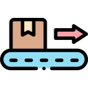

 

# Unity Addressable Importer
A simple rule based addressable asset importer.

The importer marks assets as addressable, by applying to files having a path matching the rule pattern.

## Install package

### Install as a git package

This is the recommended way to track update. Open Packages/manifest.json with your favorite text editor. Add the following line to the dependencies block.

    {
        "dependencies": {
            "com.littlebigfun.addressable-importer": "https://github.com/favoyang/unity-addressable-importer.git"
        }
    }

### Install as an embbed package via submodule

This way gives you more control if you want to modify the package based on your purpose. Fork the repo, and checkout to your Packages folder as submodule.

    git submodule add https://github.com/[YOURNAME]/unity-addressable-importer.git Packages/unity-addressable-importer
    git add -A
    git ci -m "Imported unity-addressable-importer as embbed package"

## How to use

See [usage](./Documentation~/AddressableImporter.md)

## Media

Icons made by [Freepik](https://www.flaticon.com/authors/freepik) from [flaticon.com](http://www.flaticon.com)
## Contributors ✨

Thanks goes to these wonderful people ([emoji key](https://allcontributors.org/docs/en/emoji-key)):

<!-- ALL-CONTRIBUTORS-LIST:START - Do not remove or modify this section -->
<!-- prettier-ignore -->
<table>
  <tr>
    <td align="center"><a href="http://littlebigfun.com"> <b>Favo Yang</b></a> <a href="https://github.com/favoyang/unity-addressable-importer/commits?author=favoyang" title="Code">💻</a></td>
  </tr>
</table>

<!-- ALL-CONTRIBUTORS-LIST:END -->

This project follows the [all-contributors](https://github.com/all-contributors/all-contributors) specification. Contributions of any kind welcome!